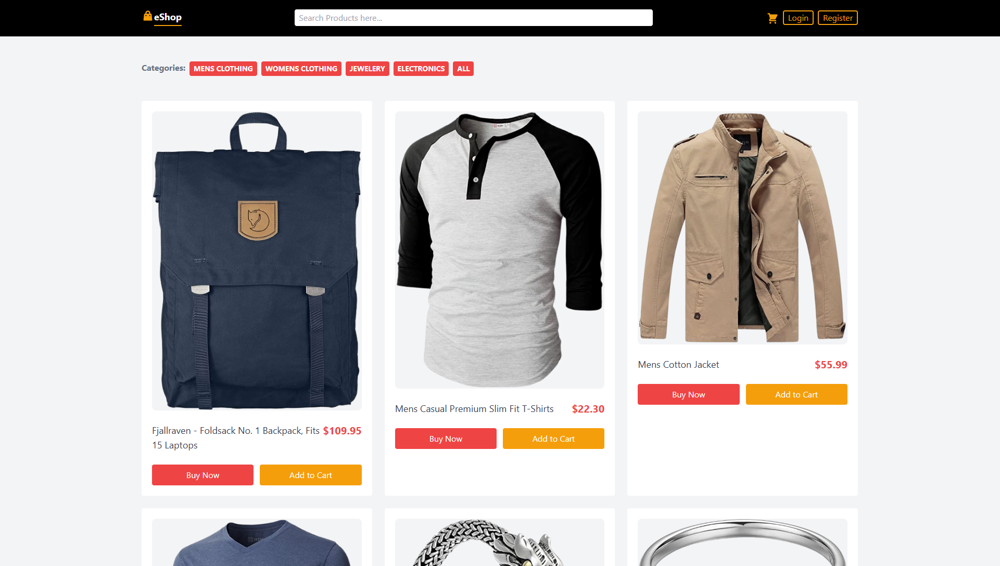

# eShop - MERN Project

A complete **eCommerce web application** built using the **MERN stack (MongoDB, Express, React + Redux, Node.js)**.  
This project includes a secure backend API and frontend interface where users can browse products, add items to their cart, and complete purchases using PayPal or COD.

**Visit Here:** [https://m-antoni-eshop-mern.vercel.app](https://m-antoni-eshop-mern.vercel.app)
<br/>
**Live Demo:** [https://youtu.be/kP-tBwVRxI8](https://youtu.be/kP-tBwVRxI8)





---

## Repositories

- **Backend (API):** [https://github.com/m-antoni/e-commerce-mern-api](https://github.com/m-antoni/e-commerce-mern-api)
- **Frontend (React UI):** [https://github.com/m-antoni/e-commerce-react](https://github.com/m-antoni/e-commerce-react)

---

## Tech Stack

| Layer              | Technology                       |
| :----------------- | :------------------------------- |
| **Frontend**       | React, Redux, TailwindCSS, Axios |
| **Backend**        | Node.js, Express.js, Mongoose    |
| **Database**       | MongoDB Atlas                    |
| **Authentication** | JWT (JSON Web Token)             |
| **Payments**       | PayPal Sandbox                   |
| **Deployment**     | Render, Vercel                  |

## Setup Instructions

### 1. Clone the Repositories

```bash
# Backend
git clone https://github.com/m-antoni/e-commerce-mern-api.git
cd e-commerce-mern-api

# Frontend
git clone https://github.com/m-antoni/e-commerce-react.git
cd e-commerce-react
```

---

## Backend Setup (API)

### 1. Install Dependencies

```bash
npm install
```

### 2. Create a `.env` file

```bash
MONGO_URI=mongodb+srv://<username>:<password>@cluster-url/eshop_db?retryWrites=true&w=majority
JWT_SECRET=your_secret_key
JWT_EXPIRES_IN=3d
APP_URL=http://localhost:5000
```

### 3. Run the Server

```bash
npm run dev
```

### 4. Logs Example

```
===================================
Server is running successfully!
URL: http://localhost:5000
Environment: development
MongoDB Connected: cluster0.mongodb.net
Database: eshop_db
===================================
```

---

## PayPal Sandbox Integration

This project supports **PayPal Sandbox payments** for testing transactions in a safe, development environment.

### 1. Create a PayPal Developer Account

1. Go to [https://developer.paypal.com/](https://developer.paypal.com/).
2. Log in using your PayPal credentials or sign up.
3. Navigate to **Dashboard → Sandbox → Accounts**.
4. Create:
   - One **Business (Merchant)** account for receiving payments.
   - One **Personal (Buyer)** account for testing purchases.

### 2. Get Your PayPal Sandbox Client ID

1. Go to **My Apps & Credentials** in the Developer Dashboard.
2. Under **Sandbox**, create a new app.
3. Copy your **Client ID**.


```

### 3. Frontend Setup for PayPal

Include the PayPal SDK script in your checkout component or dynamically load it:

```html
<script src="https://www.paypal.com/sdk/js?client-id=YOUR_PAYPAL_SANDBOX_CLIENT_ID"></script>
```

Or dynamically load it from your backend route:

```js
// Example API endpoint in backend
app.get("/api/config/paypal", (req, res) => {
  res.send({ clientId: process.env.PAYPAL_CLIENT_ID });
});
```

Then fetch it in React:

```js
const {
  data: { clientId },
} = await axios.get("/api/config/paypal");
```

### 4. Testing the Payment

Use the sandbox **Buyer** account credentials during checkout to simulate real PayPal payments.  
You can view all test transactions in your [PayPal Developer Dashboard → Sandbox → Accounts → View Transactions](https://developer.paypal.com/dashboard/accounts).

---

## Frontend Setup (React UI)

### 1. Install Dependencies

```bash
npm install
```

### 2. Start the App

```bash
npm start
```

### 3. Environment Variables (optional)

If your frontend needs API connection:

```bash
REACT_APP_API_URL=http://localhost:5000/api
REACT_APP_STORE_API=https://fakestoreapi.com/products
```

---

## Features

### Authentication

- Login / Register with JWT
- Protected routes using `PrivateRoute`
- Persistent user state using Redux Persist

### E-Commerce Core

- View product catalog
- Add to Cart
- Checkout (PayPal / Cash on Delivery)
- View past purchases

### System

- Secure Express API with validation
- MongoDB schema with relationships
- Error handling and request sanitization
- Logger using morgan for backend

---

## Developer Notes

- React Router v5 is used for navigation.
- Redux manages both user authentication and cart state.
- The backend uses Mongoose v5 (compatible with Node v18+).
- Use `npm run dev` for hot-reload in the API and `npm start` for the UI.

---

## Deployment

### Backend

Deployed via **Render**.
Environment variables must be configured in the Render Dashboard under _Environment_.

### Frontend

Deployed via **Vercel** (or Netlify).
Ensure `REACT_APP_API_URL` points to your deployed backend URL.

---

## Example .env Files

### Backend (.env)

```bash
MONGO_URI=mongodb+srv://<user>:<password>@cluster-url/eshop_db
JWT_SECRET=693C9C2BE126AC9457CA1393F9C3E
JWT_EXPIRES_IN=3d
APP_URL=https://e-commerce-mern-api.onrender.com
```

### Frontend (.env)

```bash
REACT_APP_API_URL=https://e-commerce-mern-api.onrender.com/api
REACT_APP_STORE_API=https://fakestoreapi.com/products
```


## Author

**Michael B. Antoni**  
LinkedIn: [https://linkedin.com/in/m-antoni](https://linkedin.com/in/m-antoni)  
Email: michaelantoni.tech@gmail.com
