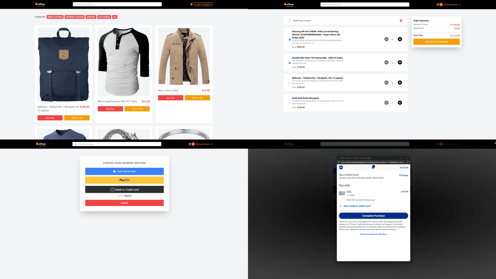

# eShop - MERN Project

A complete **eCommerce web application** built using the **MERN stack (MongoDB, Express, React + Redux, Node.js)**.  
This project includes a secure backend API and frontend interface where users can browse products, add items to their cart, and complete purchases using PayPal or COD.

The frontend and backend are packaged as separate Docker images and pushed to Docker Hub, allowing the application to be deployed on Render.com by simply pulling the respective images.

**Visit Here:** [https://eshop-mern-frontend-979607262100.asia-southeast1.run.app](https://eshop-mern-frontend-979607262100.asia-southeast1.run.app)
<br/>
**Live Demo:** [https://youtu.be/kP-tBwVRxI8](https://youtu.be/kP-tBwVRxI8)

<br/>



## Repositories

- **Backend:** [https://github.com/m-antoni/e-commerce-mern-api](https://github.com/m-antoni/e-commerce-mern-api)
- **Frontend:** [https://github.com/m-antoni/e-commerce-react](https://github.com/m-antoni/e-commerce-react)

---

## Technologies:

| Layer                  | Technology                                                                    |
| :--------------------- | :---------------------------------------------------------------------------- |
| **Frontend**           | React, Redux, TailwindCSS, sweetalert2, izitoast, react-responsive-modal, ... |
| **Backend**            | Node.js, Express.js, Mongoose, joi, xss-clean, express-mongo-sanitize, ...    |
| **Database**           | MongoDB Atlas                                                                 |
| **Authentication**     | JWT (JSON Web Token), bcryptjs                                                |
| **Payments**           | PayPal (Sandbox)                                                              |
| **Image/Containerize** | Docker, Docker Hub                                                            |
| **Deployment**         | Google Cloud Run or Render.com                                                |

---

## Features:

### Authentication

- Login / Register with JWT
- Protected routes using `PrivateRoute`
- Persistent user state using Redux Persist

### E-Commerce Core

- View product catalog
- Add to Cart
- Checkout (PayPal / Cash on Delivery)
- View past purchases

### System

- Secure Express API with validation
- MongoDB schema with relationships
- Error handling and request sanitization
- Logger using morgan for backend

---

## Setup Instructions

**Clone the Repositories**

```bash
# Backend
git clone https://github.com/m-antoni/e-commerce-mern-api.git
cd e-commerce-mern-api

# Frontend
git clone https://github.com/m-antoni/e-commerce-react.git
cd e-commerce-react
```

---

### Setup Backend (API)

**Install Dependencies**

```bash
npm install
```

**Create a `.env` file**

```bash
MONGO_URI=mongodb+srv://<username>:<password>@cluster-url/eshop_db?retryWrites=true&w=majority
JWT_SECRET=your_secret_key
JWT_EXPIRES_IN=3d
APP_URL=http://localhost:5000
```

**Run the Server**

```bash
npm run dev
```

**Logs Example**

```
===================================
Server is running successfully!
URL: http://localhost:5000
Environment: development
MongoDB Connected: cluster0.mongodb.net
Database: eshop_db
===================================
```

---

### PayPal Sandbox Integration

This project supports **PayPal Sandbox payments** for testing transactions in a safe, development environment.

**Create a PayPal Developer Account**

1. Go to [https://developer.paypal.com/](https://developer.paypal.com/).
2. Log in using your PayPal credentials or sign up.
3. Navigate to **Dashboard → Sandbox → Accounts**.
4. Create:
   - One **Business (Merchant)** account for receiving payments.
   - One **Personal (Buyer)** account for testing purchases.

**Get Your PayPal Sandbox Client ID**

1. Go to **My Apps & Credentials** in the Developer Dashboard.
2. Under **Sandbox**, create a new app.
3. Copy your **Client ID**.

**Frontend Setup for PayPal**

Include the PayPal SDK script in your checkout component or dynamically load it:

```
<script src="https://www.paypal.com/sdk/js?client-id=YOUR_PAYPAL_SANDBOX_CLIENT_ID"></script>
```

Or dynamically load it from your backend route:

```js
// Example API endpoint in backend
app.get("/api/config/paypal", (req, res) => {
  res.send({ clientId: process.env.PAYPAL_CLIENT_ID });
});
```

Then fetch it in React:

```js
const {
  data: { clientId },
} = await axios.get("/api/config/paypal");
```

**Testing the Payment:**

Use the sandbox **Buyer** account credentials during checkout to simulate real PayPal payments.  
You can view all test transactions in your [PayPal Developer Dashboard → Sandbox → Accounts → View Transactions](https://developer.paypal.com/dashboard/accounts).

---

### Setup Frontend (React + TailwindCSS)

**Environment Variables**

Go to `src/config/env.config.json`

```bash
{
  "API_URL": {
    "development": "http://localhost:5000/api",
    "production": "https://<your-production-url>/api"
  },
  "FAKE_STORE_API": "https://fakestoreapi.com/products"
}
```

**Install Dependencies**

```bash
npm install
```

**Start the App**

```bash
npm start
```

## Docker Compose

- To run the project with Docker Compose, create a file named `docker-compose.yml` in the root directory, alongside the **./frontend** and **./backend** folders.

```
version: "3.9"

services:
  backend:
    build:
      context: ./backend
      dockerfile: Dockerfile.dev
    container_name: mern-backend-dev
    ports:
      - "5000:5000"
    env_file:
      - ./backend/.env
    volumes:
      - ./backend:/app
      - /app/node_modules
    command: npm run dev

  frontend:
    build:
      context: ./frontend
      dockerfile: Dockerfile.dev
    container_name: mern-frontend-dev
    ports:
      - "3000:3000"
    volumes:
      - ./frontend:/app
      - /app/node_modules
    command: npm start

```

**Docker Compose commands**

```
# Start the frontend and backend containers in detached mode (build if needed)
docker-compose up -d

# Stop the running containers
docker-compose stop

# Remove the containers and networks
docker-compose down

# (Optional) Remove anonymous volumes as well
docker-compose down -v
```

## Developer Notes

- React Router v5 is used for navigation.
- Redux manages both user authentication and cart state.
- The backend uses Mongoose v5 (compatible with Node v18+).
- Use `npm run dev` for hot-reload in the API and `npm start` for the UI.
- Docker images allow consistent deployment across environments.

---

## Deployment

Both the frontend and backend are deployed as separate Docker images from my Docker Hub.
Each image is deployed independently on `Google Cloud Run`, allowing the frontend and backend to scale and update separately.

---

## Author

**Michael B. Antoni**  
LinkedIn: [https://linkedin.com/in/m-antoni](https://linkedin.com/in/m-antoni)  
Email: michaelantoni.tech@gmail.com
